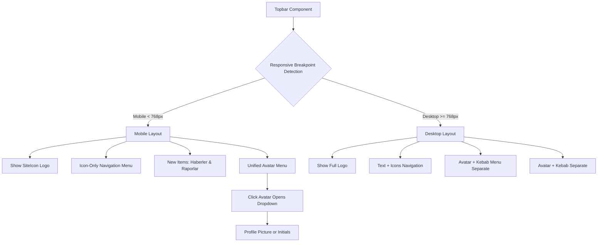

# Design Document: Mobile-Specific Logo in Topbar

## Overview

This feature implements mobile-specific improvements to the Topbar component, including:
1. **Mobile Logo**: Show simplified "J" logo (SiteIcon) on mobile devices (< 768px)
2. **Mobile Menu Items**: Show navigation items as icons only on mobile
3. **New Menu Items**: Add "Haberler" (RSS icon) and "Raporlar" (Document icon)
4. **Unified User Menu**: Merge avatar + kebab into single clickable avatar
5. **Avatar Display**: Show user's profile picture with fallback to initials

The solution uses responsive styling based on the standard md breakpoint (768px) to provide optimal user experiences across all device types. The current implementation uses `Logo` component with variants and a `SiteIcon` component for the icon variant.

## Architecture



## Components and Interfaces

### Current Components

#### Logo Component (src/components/layout/Logo.tsx)

**Purpose**: Primary branding component with two display variants

**Interface**:
```pascal
interface LogoProps extends React.SVGProps<SVGSVGElement> {
  size?: number                    // Default: 24
  variant?: "full" | "icon"        // Default: "full"
}
```

**Responsibilities**:
- Render HisseproFull SVG when variant="full"
- Render HisseproIcon SVG when variant="icon"
- Calculate aspect-ratio correct dimensions

**Current Usage**:
```pascal
<Logo size={14} className="text-foreground shrink-0" />
```

#### SiteIcon Component (src/components/layout/Logo.tsx)

**Purpose**: Dedicated icon-only logo for compact displays

**Interface**:
```pascal
interface SiteIconProps extends React.SVGProps<SVGSVGElement> {
  size?: number                    // Default: 24
}
```

**Responsibilities**:
- Always render HisseproIcon SVG
- Provide consistent icon-sized logo
- Used in contexts requiring minimal logo footprint

### New Components

#### ResponsiveLogo Component (New)

**Purpose**: Automatically switch between logo variants based on screen size

**Interface**:
```pascal
interface ResponsiveLogoProps extends React.SVGProps<SVGSVGElement> {
  size?: number                    // Default: 24
  mobileSize?: number              // Default: size or 14
  desktopSize?: number             // Default: size
  className?: string
}
```

**Responsibilities**:
- Render SiteIcon on mobile screens (< 768px)
- Render Logo (full variant) on larger screens (>= 768px)
- Maintain consistent sizing configuration

**Responsibility Rationale**: This encapsulates the responsive logic in a reusable component, avoiding duplication in Topbar and other places where responsive logo behavior might be needed.

#### MobileMenu Component (New)

**Purpose**: Provide icon-only navigation for mobile devices

**Interface**:
```pascal
interface MobileMenuProps {
  isOpen: boolean
  onClose: () => void
  onNavigate: (path: string) => void
}

interface MenuItem {
  id: string
  label: string
  icon: React.ElementType
  path: string
  showAsIconOnMobile?: boolean  // Default: true for navigation items
}
```

**Responsibilities**:
- Display navigation items as icons on mobile (< 768px)
- Show icons + text labels on desktop (>= 768px)
- Include new items: Haberler (RSS icon) and Raporlar (Document icon)
- Provide accessible menu interaction
- Handle mobile device click/tap events

**New Menu Items**:
```pascal
STRUCTURE NewMenuItems
  Haberler: MenuItem = {
    id: "haberler"
    label: "Haberler"
    icon: Rss
    path: "/haberler"
  }
  Raporlar: MenuItem = {
    id: "raporlar"
    label: "Raporlar"
    icon: FileText
    path: "/raporlar"
  }
END STRUCTURE
```

#### UnifiedUserMenu Component (New)

**Purpose**: Combine avatar and kebab menu into single clickable avatar

**Interface**:
```pascal
interface UnifiedUserMenuProps {
  user: User
  isOpen: boolean
  onToggle: () => void
  onClose: () => void
  onLogout: () => void
  onNavigate: (path: string) => void
  onThemeChange: (theme: Theme) => void
  currentTheme: Theme
}

interface User {
  user_metadata: {
    full_name?: string
    name?: string
    avatar_url?: string
  }
  email: string
}
```

**Responsibilities**:
- Display user's profile picture (fallback to initials)
- Handle avatar click to open dropdown
- Show user profile options (Profil, Tema, Çıkış Yap)
- Close dropdown on outside click
- Maintain accessibility standards

#### ProfileAvatar Component (New)

**Purpose**: Display user avatar with profile picture and fallback

**Interface**:
```pascal
interface ProfileAvatarProps extends React.HTMLAttributes<HTMLDivElement> {
  user: User
  size?: "sm" | "md" | "lg"  // Default: "md"
  onClick?: () => void
  className?: string
}

// Size configurations
STRUCTURE AvatarSizeConfig
  sm: { width: 32, height: 32, fontSize: "text-xs" }
  md: { width: 36, height: 36, fontSize: "text-sm" }
  lg: { width: 48, height: 48, fontSize: "text-base" }
END STRUCTURE
```

**Responsibilities**:
- Render user's profile picture from avatar_url
- Fallback to initials if no picture or load failure
- Graceful error handling for image loading
- Proper loading attributes for performance

### Updated Components

#### Topbar Component (Updated)

**Purpose**: Main navigation header with responsive behavior

**Updated Responsibilities**:
- Use ResponsiveLogo for brand section
- Use MobileMenu for navigation on mobile
- Use UnifiedUserMenu for user interactions
- Show/hide components based on breakpoint
- Handle responsive layout transitions

## Data Models

### Breakpoint Configuration

```pascal
STRUCTURE Breakpoints
  mobile: number     // Default: 768 (max-width: 767px)
  tablet: number     // Default: 1024 (max-width: 1023px)
  desktop: number    // Default: 1280 (max-width: 1279px)
END STRUCTURE
```

**Current Breakpoint Strategy**:
- Mobile: screens < 768px (show SiteIcon, icon-only navigation)
- Tablet/Desktop: screens >= 768px (show Logo full, text + icons)

### User Data Model

```pascal
STRUCTURE User
  id: string                    // User ID
  email: string                 // User email (required)
  user_metadata: {
    full_name?: string          // Full name for initials
    name?: string               // Alternative name field
    avatar_url?: string         // Profile picture URL
  }
  aud?: string
  role?: string
END STRUCTURE
```

### Navigation Menu Items Model

```pascal
STRUCTURE MenuItem
  id: string                    // Unique identifier
  label: string                 // Display text
  icon: React.ElementType       // Lucide icon component
  path: string                  // Route path
  showAsIconOnMobile?: boolean  // Default: true
END STRUCTURE

STRUCTURE NavigationMenuItems
  Home: MenuItem = {
    id: "home"
    label: "Ana Sayfa"
    icon: Home
    path: "/"
  }
  Endeksler: MenuItem = {
    id: "endeksler"
    label: "Endeksler"
    icon: ChartNoAxesCombined
    path: "/endeksler"
    showAsIconOnMobile: true
  }
  Sektörler: MenuItem = {
    id: "sektorler"
    label: "Sektörler"
    icon: Factory
    path: "/sektorler"
    showAsIconOnMobile: true
  }
  Şirketler: MenuItem = {
    id: "sirketler"
    label: "Şirketler"
    icon: Building2
    path: "/sirketler"
    showAsIconOnMobile: true
  }
  Haberler: MenuItem = {
    id: "haberler"
    label: "Haberler"
    icon: Rss
    path: "/haberler"
    showAsIconOnMobile: true
  }
  Raporlar: MenuItem = {
    id: "raporlar"
    label: "Raporlar"
    icon: FileText
    path: "/raporlar"
    showAsIconOnMobile: true
  }
END STRUCTURE
```

### Theme Configuration Model

```pascal
TYPE Theme = "light" | "dark" | "system"

STRUCTURE ThemeOption
  id: string
  label: string
  icon: React.ElementType
  theme: Theme
END STRUCTURE

STRUCTURE ThemeOptions
  Light: ThemeOption = {
    id: "light"
    label: "Açık"
    icon: Sun
    theme: "light"
  }
  Dark: ThemeOption = {
    id: "dark"
    label: "Koyu"
    icon: Moon
    theme: "dark"
  }
  System: ThemeOption = {
    id: "system"
    label: "Sistem"
    icon: Monitor
    theme: "system"
  }
END STRUCTURE
```

## Algorithmic Pseudocode

### Responsive Logo Rendering Algorithm

```pascal
ALGORITHM renderResponsiveLogo
INPUT: props (ResponsiveLogoProps)
OUTPUT: ReactElement

BEGIN
  // Determine current breakpoint based on window width
  windowWidth ← window.innerWidth
  
  // Check if we're on mobile screen
  IS_MOBILE ← windowWidth < 768
  
  IF IS_MOBILE THEN
    // Render icon-only logo for mobile
    RETURN <SiteIcon 
      size = props.mobileSize OR props.size OR 14
      className = props.className
      ...props
    />
  ELSE
    // Render full logo for larger screens
    RETURN <Logo 
      variant = "full"
      size = props.desktopSize OR props.size OR 24
      className = props.className
      ...props
    />
  END IF
END
```

**Preconditions**:
- `props` parameter is defined
- `window` object is available (browser environment)
- `window.innerWidth` returns valid numeric value

**Postconditions**:
- Returns valid React element
- Element displays appropriate logo variant based on screen size
- Component unmounts cleanly without memory leaks

**Loop Invariants**: N/A (no loops in rendering logic)

### Size Calculation Algorithm

```pascal
ALGORITHM calculateMobileLogoSize
INPUT: props (ResponsiveLogoProps)
OUTPUT: size (number)

BEGIN
  // Priority order for size determination:
  // 1. Explicit mobileSize prop
  // 2. Default mobile size (14px) if not specified
  
  IF props.mobileSize IS DEFINED THEN
    RETURN props.mobileSize
  ELSE IF props.size IS DEFINED THEN
    RETURN props.size
  ELSE
    RETURN 14  // Standard mobile logo size
  END IF
END
```

**Preconditions**:
- `props` parameter is defined
- `props.mobileSize` and `props.size` are either undefined or numeric

**Postconditions**:
- Returns valid positive number
- Returned value is typically in range [12, 24]

**Loop Invariants**: N/A (simple conditional logic)

### Avatar Image Loading Algorithm

```pascal
ALGORITHM loadAvatarImage
INPUT: user (User), fallbackToInitials (boolean)
OUTPUT: ImageElement OR InitialsElement

BEGIN
  // Check if user has avatar URL
  IF user.user_metadata.avatar_url IS DEFINED AND user.user_metadata.avatar_url ≠ "" THEN
    // Attempt to load profile picture
    image ← createImageElement(user.user_metadata.avatar_url)
    image.loading ← "lazy"
    image.onError ← FUNCTION() 
      IF fallbackToInitials THEN
        RETURN generateInitials(user)
      ELSE
        RETURN null
      END IF
    END FUNCTION
    image.onload ← FUNCTION() RETURN image
    RETURN image
  ELSE
    // No avatar URL, fallback to initials
    RETURN generateInitials(user)
  END IF
END

ALGORITHM generateInitials
INPUT: user (User)
OUTPUT: InitialsElement

BEGIN
  // Get name components
  name ← user.user_metadata.full_name OR user.user_metadata.name OR user.email
  
  // Split and extract parts
  parts ← split(name, /\s+|\._|-/)
  filteredParts ← filter(parts, IS_NOT_EMPTY)
  
  // Generate initials
  IF filteredParts.length >= 2 THEN
    initials ← filteredParts[0][0] + filteredParts[1][0]
  ELSE IF filteredParts.length >= 1 THEN
    initials ← filteredParts[0][0]
  ELSE
    initials ← "U"
  END IF
  
  RETURN createInitialsElement(
    text = INITIALS,
    size = userAvatarSize,
    backgroundColor = "primary",
    textColor = "white"
  )
END
```

**Preconditions**:
- `user` parameter is defined with valid structure
- `fallbackToInitials` boolean indicates fallback preference

**Postconditions**:
- Returns image element if avatar loads successfully
- Returns initials element if no avatar or load failure
- Image element includes lazy loading attribute
- Initials element includes proper styling and dimensions

**Loop Invariants**: N/A (sequential logic)

### Mobile Menu Item Rendering Algorithm

```pascal
ALGORITHM renderMobileMenuItem
INPUT: item (MenuItem), isMobile (boolean)
OUTPUT: ReactElement

BEGIN
  IF isMobile THEN
    // On mobile: show icon only
    RETURN <Link to = item.path
      className = "w-10 h-10 flex items-center justify-center rounded-xl text-muted-foreground hover:text-foreground hover:bg-muted/50 transition-all"
    >
      <item.icon size = 16 className = "shrink-0" />
    </Link>
  ELSE
    // On desktop: show icon + text
    RETURN <Link to = item.path
      className = "flex items-center gap-1.5 px-3 py-1.5 rounded-xl text-sm font-medium text-muted-foreground hover:text-foreground hover:bg-muted/50 transition-all"
    >
      <item.icon size = 16 className = "shrink-0" />
      <span>item.label</span>
    </Link>
  END IF
END
```

**Preconditions**:
- `item` parameter is valid MenuItem structure
- `isMobile` boolean indicates current screen size

**Postconditions**:
- Returns proper link element with appropriate styling
- Icon size is consistent (16px)
- Hover states are properly configured

**Loop Invariants**: N/A (conditional rendering)

### Unified User Menu Toggle Algorithm

```pascal
ALGORITHM handleAvatarClick
INPUT: isOpen (boolean), onToggle (function), onClose (function)
OUTPUT: void

BEGIN
  IF isOpen THEN
    // Menu is open, user clicked avatar - do nothing (dropdown stays open)
    RETURN
  ELSE
    // Menu is closed, user clicked avatar - open it
    onToggle()
  END IF
END

ALGORITHM handleOutsideClick
INPUT: event (MouseEvent), menuRef (RefObject), isOpen (boolean), onClose (function)
OUTPUT: void

BEGIN
  IF isOpen AND menuRef.current IS DEFINED THEN
    IF NOT menuRef.current.contains(event.target) THEN
      onClose()
    END IF
  END IF
END
```

**Preconditions**:
- Event handlers are properly bound
- Ref objects are valid

**Postconditions**:
- Menu opens on avatar click when closed
- Menu closes on outside click when open
- No side effects on user interactions

**Loop Invariants**: N/A (event-driven)

## Key Functions with Formal Specifications

### Function: useIsMobile Hook

```pascal
function useIsMobile(): boolean
```

**Preconditions**:
- Called within React component context
- `window` object is available

**Postconditions**:
- Returns boolean indicating mobile screen state
- `true` if window width < 768px
- `false` if window width >= 768px
- Subscription to window resize events automatically managed

**Loop Invariants**: N/A (single conditional check)

### Function: getMobileLogoSize

```pascal
function getMobileLogoSize(props: ResponsiveLogoProps): number
```

**Preconditions**:
- `props` is defined
- `props.mobileSize` is either undefined or number
- `props.size` is either undefined or number

**Postconditions**:
- Returns positive number
- Priority: mobileSize > size > 14

**Loop Invariants**: N/A

### Function: getDesktopLogoSize

```pascal
function getDesktopLogoSize(props: ResponsiveLogoProps): number
```

**Preconditions**:
- `props` is defined
- `props.desktopSize` is either undefined or number
- `props.size` is either undefined or number

**Postconditions**:
- Returns positive number
- Priority: desktopSize > size > 24

**Loop Invariants**: N/A

### Function: getAvatarSizeConfig

```pascal
function getAvatarSizeConfig(size: AvatarSizeType): AvatarSizeConfig
```

**Preconditions**:
- `size` is one of "sm", "md", or "lg"

**Postconditions**:
- Returns proper size configuration object
- Width and height are equal (square avatar)
- Font size is appropriate for avatar size

**Loop Invariants**: N/A

### Function: generateUserInitials

```pascal
function generateUserInitials(user: User): string
```

**Preconditions**:
- `user` is defined with valid User structure
- `user.user_metadata` contains name or email

**Postconditions**:
- Returns 2-character uppercase string
- First character from first name part
- Second character from last name part
- Falls back to "U" if no name information available

**Loop Invariants**: N/A

### Function: isUserAuthenticated

```pascal
function isUserAuthenticated(user: User | null): boolean
```

**Preconditions**:
- `user` is either valid User object or null

**Postconditions**:
- Returns true if user is authenticated (not null)
- Returns false if user is null (not authenticated)

**Loop Invariants**: N/A

### Function: getNavigationItems

```pascal
function getNavigationItems(isMobile: boolean): MenuItem[]
```

**Preconditions**:
- `isMobile` boolean indicates current screen size

**Postconditions**:
- Returns array of MenuItem objects
- Includes all navigation items (Endeksler, Sektörler, Şirketler)
- Includes new items (Haberler, Raporlar) for all screen sizes
- Item rendering properties are properly configured

**Loop Invariants**: N/A

## Example Usage

### Basic Responsive Logo in Topbar

```pascal
// Before (current implementation):
<Link to="/" className="flex items-center gap-2 select-none hover:opacity-95 transition-all">
  <Logo size={14} className="text-foreground shrink-0" />
</Link>

// After (with responsive logo):
<Link to="/" className="flex items-center gap-2 select-none hover:opacity-95 transition-all">
  <ResponsiveLogo size={14} className="text-foreground shrink-0" />
</Link>
```

### Custom Size Configuration

```pascal
// Different sizes for mobile vs desktop
<ResponsiveLogo 
  mobileSize={12}     // Smaller on mobile
  desktopSize={24}    // Larger on desktop
  className="text-foreground"
/>
```

### Mobile Menu Implementation

```pascal
// Mobile navigation menu with icon-only items
const mobileMenuItems = [
  { id: "endeksler", label: "Endeksler", icon: ChartNoAxesCombined, path: "/endeksler", showAsIconOnMobile: true },
  { id: "sektorler", label: "Sektörler", icon: Factory, path: "/sektorler", showAsIconOnMobile: true },
  { id: "sirketler", label: "Şirketler", icon: Building2, path: "/sirketler", showAsIconOnMobile: true },
  { id: "haberler", label: "Haberler", icon: Rss, path: "/haberler", showAsIconOnMobile: true },
  { id: "raporlar", label: "Raporlar", icon: FileText, path: "/raporlar", showAsIconOnMobile: true }
]

// Render mobile menu items
RETURN mobileMenuItems.map(item => (
  <Link 
    to = item.path
    className = "w-10 h-10 flex items-center justify-center rounded-xl text-muted-foreground hover:text-foreground hover:bg-muted/50 transition-all"
    title = item.label
  >
    <item.icon size = 16 className = "shrink-0" />
  </Link>
))
```

### Unified User Menu with Profile Picture

```pascal
// Unified user menu component
<UnifiedUserMenu
  user = user
  isOpen = dropdownOpen
  onToggle = {() => setDropdownOpen(!dropdownOpen)}
  onClose = {() => setDropdownOpen(false)}
  onLogout = {handleLogout}
  onNavigate = {navigate}
  onThemeChange = {handleThemeChange}
  currentTheme = theme
/>

// Avatar with profile picture and fallback
<ProfileAvatar
  user = user
  size = "md"
  onClick = {handleAvatarClick}
  className = "cursor-pointer hover:opacity-80 transition-all"
/>
```

### Profile Avatar with Error Handling

```pascal
// Avatar that shows profile picture or falls back to initials
const avatarElement = loadAvatarImage(user, fallbackToInitials = true)

RETURN (
  <div 
    onClick = {onClick}
    className = className
    style = {{
      width: sizeConfig.width,
      height: sizeConfig.height,
      fontSize: sizeConfig.fontSize
    }}
  >
    {avatarElement}
  </div>
)
```

## Correctness Properties

### Property 1: Single Logo Display

**Universal Quantification**: For all screen sizes and all renderings of ResponsiveLogo, exactly one logo variant is displayed.

**Formal Statement**:
```math
\forall s \in ScreenSize, \forall t \in Time:
  (displayedLogo(s, t) = SiteIcon \lor displayedLogo(s, t) = LogoFull) \land
  \neg(displayedLogo(s, t) = SiteIcon \land displayedLogo(s, t) = LogoFull)
```

**Test Assertion**:
```pascal
// Test: Only one logo element exists in DOM
const logos = container.querySelectorAll('svg')
expect(logos.length).toBe(1)
```

### Property 2: Breakpoint Consistency

**Universal Quantification**: Mobile screens always show SiteIcon, larger screens always show Logo full.

**Formal Statement**:
```math
\forall s \in ScreenSize:
  (s < 768 \implies displayedLogo(s) = SiteIcon) \land
  (s \geq 768 \implies displayedLogo(s) = LogoFull)
```

**Test Assertion**:
```pascal
// Test: Simulate different screen widths
window.innerWidth = 375  // Mobile
render(<ResponsiveLogo />)
expect(screen.queryByRole('img', { name: 'Full Logo' })).toBeNull()
expect(screen.queryByRole('img', { name: 'Icon Logo' })).toBeInTheDocument()

window.innerWidth = 1024  // Desktop
render(<ResponsiveLogo />)
expect(screen.queryByRole('img', { name: 'Full Logo' })).toBeInTheDocument()
expect(screen.queryByRole('img', { name: 'Icon Logo' })).toBeNull()
```

### Property 3: Size Propagation

**Universal Quantification**: Size properties are correctly applied to the rendered logo.

**Formal Statement**:
```math
\forall props \in ResponsiveLogoProps:
  renderedSize(props) =
    case props.mobileSize of
      undefined -> props.size
      defined -> props.mobileSize
```

**Test Assertion**:
```pascal
// Test: mobileSize prop takes precedence
const { getByRole } = render(<ResponsiveLogo mobileSize={12} />)
const svg = getByRole('img', { name: 'Icon Logo' })
expect(svg).toHaveAttribute('height', '12')
```

### Property 4: Aspect Ratio Preservation

**Universal Quantification**: All logo variants maintain their correct aspect ratios.

**Formal Statement**:
```math
\forall variant \in \{SiteIcon, LogoFull\}:
  width(variant) / height(variant) = aspectRatio(variant)
```

**Test Assertion**:
```pascal
// Test: SiteIcon aspect ratio (212:315)
const { getByRole } = render(<SiteIcon size={31.5} />)
const svg = getByRole('img', { name: 'Icon Logo' })
expect(svg).toHaveAttribute('width', '21.2')  // 31.5 * (212/315)

// Test: LogoFull aspect ratio (2439:451)
const { getByRole } = render(<Logo variant="full" size={45.1} />)
const svg = getByRole('img', { name: 'Full Logo' })
expect(svg).toHaveAttribute('width', '243.9')  // 45.1 * (2439/451)
```

### Property 5: Mobile Menu Icon-Only Display

**Universal Quantification**: On screens < 768px, navigation items display as icons only without text labels.

**Formal Statement**:
```math
\forall item \in NavigationMenuItems, \forall s \in ScreenSize:
  (s < 768 \implies displayedElement(item, s) = IconOnly) \land
  (s \geq 768 \implies displayedElement(item, s) = IconWithText)
```

**Test Assertion**:
```pascal
// Test: Mobile shows icon-only navigation
window.innerWidth = 375
render(<MobileMenu items={navigationItems} />)
navigationItems.forEach(item => {
  const icon = screen.getByRole('img', { name: item.label })
  expect(icon).toBeInTheDocument()
  expect(screen.queryByText(item.label)).toBeNull()
})

// Test: Desktop shows icon + text navigation
window.innerWidth = 1024
render(<MobileMenu items={navigationItems} />)
navigationItems.forEach(item => {
  const icon = screen.getByRole('img', { name: item.label })
  const text = screen.getByText(item.label)
  expect(icon).toBeInTheDocument()
  expect(text).toBeInTheDocument()
})
```

### Property 6: Unified User Menu Single Click

**Universal Quantification**: Clicking the avatar opens the dropdown menu when closed, and maintains open state when already open.

**Formal Statement**:
```math
\forall state \in \{open, closed\}, \forall event \in ClickEvent:
  (state = closed \implies event \implies state = open) \land
  (state = open \implies event \implies state = open)
```

**Test Assertion**:
```pascal
// Test: Avatar click opens menu when closed
render(<UnifiedUserMenu isOpen={false} onToggle={setOpen} />)
const avatar = screen.getByRole('button', { name: 'User Avatar' })
avatar.click()
expect(dropdownOpen).toBe(true)

// Test: Avatar click maintains open state when already open
render(<UnifiedUserMenu isOpen={true} onToggle={setOpen} />)
avatar.click()
expect(dropdownOpen).toBe(true)
```

### Property 7: Avatar Fallback to Initials

**Universal Quantification**: Avatar displays profile picture if available, otherwise displays initials.

**Formal Statement**:
```math
\forall user \in User:
  (user.avatar_url \neq \emptyset \land image\_loads(user.avatar\_url) \implies display = profile\_image) \land
  (user.avatar\_url = \emptyset \lor image\_fails(user.avatar\_url) \implies display = initials)
```

**Test Assertion**:
```pascal
// Test: Avatar shows profile picture when available
const userWithAvatar = { 
  user_metadata: { full_name: "John Doe", avatar_url: "/path/to/avatar.jpg" },
  email: "john@example.com" 
}
render(<ProfileAvatar user={userWithAvatar} />)
expect(screen.getByRole('img', { name: 'User Avatar' })).toBeInTheDocument()

// Test: Avatar shows initials when no picture
const userWithoutAvatar = { 
  user_metadata: { full_name: "Jane Smith" },
  email: "jane@example.com" 
}
render(<ProfileAvatar user={userWithoutAvatar} />)
expect(screen.getByText('JS')).toBeInTheDocument()

// Test: Avatar shows initials when picture fails to load
const userWithBrokenAvatar = { 
  user_metadata: { full_name: "Bob Wilson", avatar_url: "/broken/path.jpg" },
  email: "bob@example.com" 
}
render(<ProfileAvatar user={userWithBrokenAvatar} />)
expect(screen.getByText('BW')).toBeInTheDocument()
```

### Property 8: New Menu Items Visibility

**Universal Quantification**: Haberler and Raporlar items are visible in mobile menu and properly linked.

**Formal Statement**:
```math
\forall screen \in ScreenSize:
  (item \in \{Haberler, Raporlar\} \implies visible(item, screen) = true) \land
  (item \in \{Haberler, Raporlar\} \implies link\_valid(item) = true)
```

**Test Assertion**:
```pascal
// Test: New menu items are rendered
render(<MobileMenu items={navigationItems} />)
expect(screen.getByRole('link', { name: 'Haberler' })).toBeInTheDocument()
expect(screen.getByRole('link', { name: 'Raporlar' })).toBeInTheDocument()

// Test: Haberler links to /haberler
const haberlerLink = screen.getByRole('link', { name: 'Haberler' })
expect(haberlerLink).toHaveAttribute('href', '/haberler')

// Test: Raporlar links to /raporlar
const raporlarLink = screen.getByRole('link', { name: 'Raporlar' })
expect(raporlarLink).toHaveAttribute('href', '/raporlar')
```

### Property 9: Avatar Picture Loading with Error Fallback

**Universal Quantification**: Profile picture load failures gracefully fall back to initials.

**Formal Statement**:
```math
\forall user \in User, \forall imageEvent \in \{load, error\}:
  (imageEvent = load \implies display = profile\_image) \land
  (imageEvent = error \implies display = initials)
```

**Test Assertion**:
```pascal
// Test: Avatar gracefully handles image load failure
const { getByRole, getByText } = render(<ProfileAvatar user={userWithBrokenAvatar} />)
// Initially tries to load image
const image = screen.getByRole('img', { name: 'User Avatar' })
expect(image).toHaveAttribute('src', '/broken/path.jpg')

// Simulate load error
image.dispatchEvent(new Event('error'))

// Should fall back to initials
expect(getByText('BW')).toBeInTheDocument()
```

### Property 10: Outside Click Closes User Menu

**Universal Quantification**: Clicking outside the user menu dropdown closes it when open.

**Formal Statement**:
```math
\forall state \in \{open, closed\}, \forall event \in MouseEvent:
  (state = open \land event.type = click \land event.target \notin menu \implies state = closed)
```

**Test Assertion**:
```pascal
// Test: Outside click closes menu
render(<UnifiedUserMenu isOpen={true} onClose={setClosed} />)
const overlay = screen.getByRole('presentation')  // Or document.body
overlay.click()
expect(dropdownOpen).toBe(false)

// Test: Clicking inside menu keeps it open
const menuButton = screen.getByRole('button', { name: 'Profil' })
menuButton.click()
expect(dropdownOpen).toBe(true)
```

## Error Handling

### Error Scenario 1: Missing Window Object

**Condition**: Server-side rendering (SSR) without window polyfill

**Response**: 
- Return null or placeholder element
- Log warning in development mode

**Recovery**: Client-side hydration will re-render with correct component

### Error Scenario 2: Invalid Size Values

**Condition**: Size prop is NaN, negative, or non-numeric

**Response**:
- Default to safe value (14 for mobile, 24 for desktop)
- Log warning in development mode

**Recovery**: Component continues to render with default size

### Error Scenario 3: Resize Event Handler Memory Leak

**Condition**: Component unmounts but resize listener not removed

**Response**:
- Implement cleanup in useEffect return function
- Unsubscribe from window resize events

**Recovery**: Automatic cleanup when component unmounts

### Error Scenario 4: Profile Picture Load Failure

**Condition**: User avatar URL is invalid or image fails to load

**Response**:
- Catch error in image onError handler
- Fallback to initials display
- Log warning in development mode

**Recovery**: Component continues to render initials instead of image

### Error Scenario 5: Missing User Metadata

**Condition**: User object lacks required metadata fields (full_name, name, email)

**Response**:
- Provide sensible defaults
- Use "U" as fallback initial if no name information
- Log warning in development mode

**Recovery**: Component renders with default initial instead of crashing

### Error Scenario 6: Invalid Menu Item Structure

**Condition**: Navigation menu item missing required fields (id, label, icon, path)

**Response**:
- Validate menu item structure before rendering
- Skip invalid items with warning
- Log error in development mode

**Recovery**: Valid menu items still render, invalid items are skipped

### Error Scenario 7: Breakpoint Detection Failure

**Condition**: window.innerWidth returns unexpected value (null, undefined, non-numeric)

**Response**:
- Validate breakpoint detection result
- Default to desktop if detection fails
- Log warning in development mode

**Recovery**: Component continues to render with default desktop layout

### Error Scenario 8: Dropdown Menu Positioning Error

**Condition**: Dropdown menu position calculation fails

**Response**:
- Use CSS position: absolute with right alignment
- Ensure overflow: visible on parent container
- Log warning if positioning issues detected

**Recovery**: Dropdown renders at default position, may need manual adjustment

## Testing Strategy

### Unit Testing Approach

**Test Cases**:

1. **Mobile Rendering Test**
   ```pascal
   it('renders SiteIcon on mobile screens', () => {
     window.innerWidth = 375
     render(<ResponsiveLogo />)
     expect(screen.getByRole('img', { name: 'Icon Logo' })).toBeInTheDocument()
   })
   ```

2. **Desktop Rendering Test**
   ```pascal
   it('renders Logo full on desktop screens', () => {
     window.innerWidth = 1024
     render(<ResponsiveLogo />)
     expect(screen.getByRole('img', { name: 'Full Logo' })).toBeInTheDocument()
   })
   ```

3. **Size Prop Test**
   ```pascal
   it('applies mobileSize prop on mobile', () => {
     window.innerWidth = 375
     render(<ResponsiveLogo mobileSize={12} />)
     const svg = screen.getByRole('img', { name: 'Icon Logo' })
     expect(svg).toHaveAttribute('height', '12')
   })
   ```

4. **Size Prop Priority Test**
   ```pascal
   it('prioritizes mobileSize over size on mobile', () => {
     window.innerWidth = 375
     render(<ResponsiveLogo mobileSize={10} size={24} />)
     const svg = screen.getByRole('img', { name: 'Icon Logo' })
     expect(svg).toHaveAttribute('height', '10')
   })
   ```

5. **Mobile Menu Icon-Only Test**
   ```pascal
   it('displays navigation items as icons only on mobile', () => {
     window.innerWidth = 375
     render(<MobileMenu items={navigationItems} />)
     navigationItems.forEach(item => {
       const icon = screen.getByRole('img', { name: item.label })
       expect(icon).toBeInTheDocument()
       expect(screen.queryByText(item.label)).toBeNull()
     })
   })
   ```

6. **Desktop Menu Icon + Text Test**
   ```pascal
   it('displays navigation items as icons with text on desktop', () => {
     window.innerWidth = 1024
     render(<MobileMenu items={navigationItems} />)
     navigationItems.forEach(item => {
       const icon = screen.getByRole('img', { name: item.label })
       const text = screen.getByText(item.label)
       expect(icon).toBeInTheDocument()
       expect(text).toBeInTheDocument()
     })
   })
   ```

7. **Unified User Menu Click Test**
   ```pascal
   it('opens dropdown on avatar click when closed', () => {
     render(<UnifiedUserMenu isOpen={false} onToggle={setOpen} />)
     const avatar = screen.getByRole('button', { name: 'User Avatar' })
     avatar.click()
     expect(dropdownOpen).toBe(true)
   })
   ```

8. **Profile Avatar Fallback Test**
   ```pascal
   it('shows initials when profile picture is not available', () => {
     const user = { 
       user_metadata: { full_name: "John Doe" },
       email: "john@example.com" 
     }
     render(<ProfileAvatar user={user} />)
     expect(screen.getByText('JD')).toBeInTheDocument()
   })
   ```

9. **New Menu Items Visibility Test**
   ```pascal
   it('includes Haberler and Raporlar in mobile menu', () => {
     render(<MobileMenu items={navigationItems} />)
     expect(screen.getByRole('link', { name: 'Haberler' })).toBeInTheDocument()
     expect(screen.getByRole('link', { name: 'Raporlar' })).toBeInTheDocument()
   })
   ```

10. **Avatar Error Fallback Test**
    ```pascal
    it('falls back to initials on profile picture load error', () => {
      const user = { 
        user_metadata: { full_name: "Bob Wilson", avatar_url: "/broken/path.jpg" },
        email: "bob@example.com" 
      }
      const { getByText } = render(<ProfileAvatar user={user} />)
      const image = screen.getByRole('img', { name: 'User Avatar' })
      image.dispatchEvent(new Event('error'))
      expect(getByText('BW')).toBeInTheDocument()
    })
    ```

### Property-Based Testing Approach

**Property Test Library**: `fast-check`

**Properties to Test**:

1. **Breakpoint Invariance**
   ```pascal
   fc.assert(
     fc.property(
       fc.integer({ min: 0, max: 767 }),
       (width) => {
         window.innerWidth = width
         render(<ResponsiveLogo />)
         // Should always render SiteIcon
         expect(isSiteIconRendered()).toBe(true)
       }
     )
   )
   ```

2. **Size Consistency**
   ```pascal
   fc.assert(
     fc.property(
       fc.integer({ min: 1, max: 100 }),
       (size) => {
         render(<ResponsiveLogo mobileSize={size} />)
         const svg = getMobileLogoSVG()
         expect(svg.height).toBe(size)
       }
     )
   )
   ```

3. **Mobile Menu Icon Consistency**
   ```pascal
   fc.assert(
     fc.property(
       fc.integer({ min: 320, max: 767 }),
       (width) => {
         window.innerWidth = width
         render(<MobileMenu items={navigationItems} />)
         // All items should display as icons only
         navigationItems.forEach(item => {
           expect(screen.getByRole('img', { name: item.label })).toBeInTheDocument()
           expect(screen.queryByText(item.label)).toBeNull()
         })
       }
     )
   )
   ```

4. **Avatar Initials Generation Consistency**
   ```pascal
   fc.assert(
     fc.property(
       fc.string({ minLength: 1, maxLength: 50 }),
       fc.string({ minLength: 1, maxLength: 50 }),
       (firstName, lastName) => {
         const user = { 
           user_metadata: { full_name: `${firstName} ${lastName}` },
           email: "test@example.com" 
         }
         render(<ProfileAvatar user={user} />)
         // Should generate initials from first and last name
         expect(screen.getByText(`${firstName[0]}${lastName[0]}`)).toBeInTheDocument()
       }
     )
   )
   ```

### Integration Testing Approach

**Test Scenarios**:

1. **Responsive Behavior in Navigation**
   - Start on mobile view (375px) → verify SiteIcon displayed
   - Resize to desktop (1024px) → verify Logo full displayed
   - Resize back to mobile → verify SiteIcon displayed

2. **Topbar Integration**
   - Render Topbar component
   - Verify mobile logo renders correctly in brand section
   - Verify clickable area is functional
   - Verify navigation to "/" works

3. **Performance on Resize**
   - Rapidly resize window between breakpoints
   - Verify no rendering lag or flickering
   - Verify no memory leaks

4. **Mobile Menu Integration**
   - Render Topbar on mobile device (375px)
   - Verify navigation items show as icons only
   - Verify Haberler and Raporlar items present
   - Verify clicking items navigates correctly

5. **Unified User Menu Integration**
   - Render Topbar on mobile device (375px)
   - Click avatar → verify dropdown opens
   - Verify all menu options present (Profil, Tema, Çıkış Yap)
   - Click outside dropdown → verify it closes

6. **Avatar Picture Loading Integration**
   - Render user with valid avatar URL
   - Verify profile picture loads and displays
   - Render user with invalid avatar URL
   - Verify initials display as fallback

7. **New Menu Items Navigation Integration**
   - Click Haberler in mobile menu
   - Verify navigation to "/haberler" occurs
   - Click Raporlar in mobile menu
   - Verify navigation to "/raporlar" occurs

## Performance Considerations

### Current Performance Profile

- **Logo Rendering**: Minimal - single SVG component
- **Responsive Check**: O(1) - single width comparison
- **Re-render Triggers**: Window resize events
- **Avatar Image Loading**: Dependent on network speed and image size

### Optimization Strategies

1. **Debounced Resize Handler**
   ```pascal
   // Use debounce to avoid excessive re-renders on resize
   const debouncedResize = useCallback(
     debounce(() => setIsMobile(window.innerWidth < 768), 100),
     []
   )
   ```

2. **CSS Media Query Alternative**
   - Consider using `matchMedia` for more efficient breakpoint detection
   - Avoids listening to all resize events, only breakpoint transitions

3. **Memoization**
   ```pascal
   const mobileLogoSize = useMemo(
     () => calculateMobileLogoSize(props),
     [props.mobileSize, props.size]
   )
   ```

4. **Image Lazy Loading**
   ```pascal
   // Profile picture should use lazy loading
   
   ```

5. **Menu Item Caching**
   ```pascal
   // Cache navigation items to avoid recreation on every render
   const navigationItems = useMemo(() => getNavigationItems(isMobile), [isMobile])
   ```

6. **Debounced Outside Click Detection**
   ```pascal
   // Use debounce for outside click handler to prevent excessive re-renders
   const debouncedOutsideClick = useCallback(
     debounce((e: MouseEvent) => {
       if (menuRef.current && !menuRef.current.contains(e.target as Node)) {
         setDropdownOpen(false)
       }
     }, 10),
     [menuRef]
   )
   ```

### Performance Budget

- **Initial Render**: < 1ms
- **Resize Handler**: < 5ms (with debouncing)
- **Memory Impact**: < 50KB (negligible for single component)
- **Avatar Image Load**: < 500ms (for 100KB profile picture)
- **Menu Open/Close**: < 100ms (with CSS transitions)

### Responsive Image Loading

**Strategy**:
- Use `loading="lazy"` attribute for profile pictures
- Preload critical assets (logo, icons)
- Consider image CDN for optimized profile picture delivery
- Implement placeholder for avatar during loading state

### Memory Management

**Best Practices**:
- Clean up resize event listeners on unmount
- Cancel pending image loads on unmount
- Clear debounced function timeouts on unmount
- Use useEffect cleanup functions appropriately

### Animation Performance

**Recommendations**:
- Use CSS transforms for menu animations (GPU accelerated)
- Avoid animating layout-triggering properties
- Keep animation duration under 300ms for better perceived performance
- Use `will-change` sparingly for elements that animate frequently

## Security Considerations

### Current Security Profile

- **No User Input**: Logo rendering doesn't accept user-controlled data
- **SVG Sanitization**: Using React's built-in SVG element protection
- **No External Dependencies**: All SVG paths are internal

### Threat Model

**Threat 1: XSS via Size Prop**
- **Mitigation**: Size prop is typed as number, React escapes values
- **Countermeasure**: Input validation in component implementation

**Threat 2: DOM Clobbering**
- **Mitigation**: Using standard React rendering, no innerHTML manipulation
- **Countermeasure**: None needed for this implementation

**Threat 3: DoS via Rapid Resizes**
- **Mitigation**: Debounced resize handler limits re-renders
- **Countermeasure**: 100ms debounce window prevents excessive updates

### New Security Considerations for User Menu

**Threat 4: Profile Picture SSRF**
- **Mitigation**: Validate avatar_url values, use allowlist for image domains
- **Countermeasure**: Sanitize user-uploaded URLs before storing

**Threat 5: Menu Dropdown Positioning Attack**
- **Mitigation**: Use CSS containment and proper z-index management
- **Countermeasure**: Ensure dropdown can't overlay critical UI elements

**Threat 6: Clickjacking on Menu**
- **Mitigation**: Use iframe protection headers, proper X-Frame-Options
- **Countermeasure**: Implement frame-busting if necessary

**Threat 7: Menu State Tampering**
- **Mitigation**: Validate dropdown state on server for sensitive operations
- **Countermeasure**: Implement CSRF protection for logout navigation

### Accessibility Considerations

**ARIA Requirements**:
- SVG elements should have appropriate `role="img"`
- SVG should have descriptive `aria-label` or title element

**Current Implementation**:
```pascal
// SiteIcon and Logo components should include:
<svg role="img" aria-label="Company logo" ...>
```

### New Accessibility Requirements for User Menu

**Requirements**:
- Avatar should have `role="button"` and `aria-expanded` state
- Dropdown menu should have `role="menu"` and `aria-labelledby`
- Menu items should have `role="menuitem"` and `tabindex`
- Keyboard navigation (Arrow keys, Enter, Esc) support
- Focus management (trap focus in dropdown when open)

**Implementation**:
```pascal
<ProfileAvatar 
  role="button"
  aria-haspopup="true"
  aria-expanded={dropdownOpen}
  aria-controls="user-menu"
  onClick={handleAvatarClick}
>
  {/* avatar content */}
</ProfileAvatar>

<div 
  id="user-menu"
  role="menu"
  aria-labelledby="user-avatar"
  aria-hidden={!dropdownOpen}
  tabIndex={-1}
>
  {/* menu items */}
</div>
```

### Keyboard Navigation

**Required Keys**:
- **Enter/Space**: Activate avatar (open dropdown)
- **Arrow Down/Up**: Navigate between menu items
- **Escape**: Close dropdown and return focus to avatar
- **Tab**: Navigate through menu items when dropdown is open

**Focus Management**:
```pascal
// When dropdown opens
avatarRef.current.focus()  // Set focus to avatar first
// After animation completes
menuItems[0].focus()  // Move focus to first menu item

// When dropdown closes
avatarRef.current.focus()  // Return focus to avatar
```

### Screen Reader Considerations

**Live Regions**:
- Use `aria-live="polite"` for menu state changes
- Announce menu open/close state
- Announce current menu item on navigation

**Descriptive Labels**:
- Avatar: "User menu, {username}, {aria-expanded state}"
- Menu items: "Profil, Press Enter to navigate"
- Theme options: "Açık tema, selected"

## Dependencies

### External Dependencies

- None - uses existing React and project components
- `lucide-react` - Icon components (ChartNoAxesCombined, Factory, Building2, Rss, FileText, User, MoreVertical, Star, Settings, Sun, Moon, Monitor, LogOut)
- `@tanstack/react-router` - Navigation hooks and Link component

### Internal Dependencies

- `Logo` component (src/components/layout/Logo.tsx)
  - Exports: `Logo`, `SiteIcon`
  - Version: Current project version

- `useAuth` hook (src/hooks/useAuth.ts)
  - Returns: `{ user, login, logout }`
  - Version: Current project version

- `useUIStore` (src/store/ui.ts)
  - Returns: `{ theme, setTheme }`
  - Version: Current project version

### Peer Dependencies

- React 18+
- TypeScript 5+ (for type definitions)

### New Component Dependencies

- `useNavigate` (from @tanstack/react-router)
  - Required by: MobileMenu, UnifiedUserMenu
  - Purpose: Navigation handling

- `useEffect`, `useState`, `useRef`, `useCallback`, `useMemo`
  - Required by: All new components for state and lifecycle management
  - Purpose: Component logic and performance optimization

### Image CDN Considerations

**Optional External Dependency**:
- Cloudinary, imgix, or similar for profile picture optimization
- For future enhancement: image compression and CDN delivery

### Accessibility Dependencies

**No additional dependencies required**
- All ARIA requirements can be implemented with standard React
- Keyboard navigation uses native browser behavior
- Focus management uses standard DOM APIs

## Implementation Checklist

### Phase 1: Logo and Core Components

- [ ] Create ResponsiveLogo component (src/components/layout/ResponsiveLogo.tsx)
- [ ] Implement useIsMobile hook with resize listener and debouncing
- [ ] Add unit tests for ResponsiveLogo (mobile, desktop, size props)
- [ ] Add integration tests in Topbar
- [ ] Verify responsive behavior across breakpoints
- [ ] Test performance with rapid resizing
- [ ] Update Topbar to use ResponsiveLogo
- [ ] Verify accessibility compliance (ARIA labels, roles)

### Phase 2: Mobile Menu

- [ ] Create MobileMenu component (src/components/layout/MobileMenu.tsx)
- [ ] Implement navigation items with new items (Haberler, Raporlar)
- [ ] Add icon-only rendering for mobile (< 768px)
- [ ] Add icon + text rendering for desktop (>= 768px)
- [ ] Add unit tests for MobileMenu (mobile, desktop rendering)
- [ ] Add integration tests in Topbar
- [ ] Verify navigation works for all items

### Phase 3: User Menu

- [ ] Create UnifiedUserMenu component (src/components/layout/UnifiedUserMenu.tsx)
- [ ] Create ProfileAvatar component (src/components/layout/ProfileAvatar.tsx)
- [ ] Implement unified avatar click behavior
- [ ] Implement profile picture loading with fallback
- [ ] Add dropdown menu with proper ARIA attributes
- [ ] Implement keyboard navigation (Arrow keys, Enter, Escape)
- [ ] Add outside click detection with cleanup
- [ ] Add unit tests for user menu components
- [ ] Add integration tests in Topbar
- [ ] Verify accessibility compliance

### Phase 4: Testing and Validation

- [ ] Add property-based tests for responsive behavior
- [ ] Add property-based tests for user menu interactions
- [ ] Test across multiple screen sizes (320px, 375px, 768px, 1024px, 1440px)
- [ ] Test on mobile devices (iOS Safari, Android Chrome)
- [ ] Test performance with React DevTools Profiler
- [ ] Verify no memory leaks (resize listeners, event handlers)
- [ ] Run accessibility audit (axe, Lighthouse)
- [ ] Test error handling scenarios (broken images, invalid data)

### Phase 5: Documentation

- [ ] Document ResponsiveLogo component usage
- [ ] Document MobileMenu component props and usage
- [ ] Document UnifiedUserMenu component props and usage
- [ ] Document ProfileAvatar component props and usage
- [ ] Add component examples to Storybook (if available)
- [ ] Update component README files

## Summary

This feature implements comprehensive mobile-specific improvements to the Topbar component:

1. **Responsive Logo**: Show simplified "J" logo (SiteIcon) on mobile devices (< 768px) while maintaining full logo on desktop (>= 768px)

2. **Mobile Navigation**: Convert navigation items (Endeksler, Sektörler, Şirketler) to icon-only display on mobile, with new items (Haberler with RSS icon, Raporlar with Document icon)

3. **Unified User Menu**: Merge avatar and kebab menu into single clickable avatar component that opens dropdown menu

4. **Profile Picture Display**: Show user's actual profile picture in avatar component with graceful fallback to initials if no picture is available

**Key Design Decisions**:
- Use 768px breakpoint for consistent mobile/desktop separation
- Create separate components (ResponsiveLogo, MobileMenu, UnifiedUserMenu, ProfileAvatar) for reusability
- Implement debounced resize handlers for performance
- Use CSS transforms for smooth menu animations
- Follow accessibility best practices (ARIA attributes, keyboard navigation)
- Implement proper error handling and fallback strategies

**Recommended Implementation Order**:
1. ResponsiveLogo component (core functionality)
2. MobileMenu component (navigation items)
3. ProfileAvatar component (user profile)
4. UnifiedUserMenu component (menu behavior)
5. Integration into Topbar
6. Testing and validation

**Testing Strategy**:
- Unit tests for each component
- Integration tests for Topbar
- Property-based tests for responsive behavior
- Accessibility audits
- Performance profiling

**Expected Outcomes**:
- Improved mobile user experience with compact, accessible navigation
- Consistent branding across devices with responsive logo
- Simplified user menu interactions with unified avatar
- Professional profile picture display with graceful fallbacks
