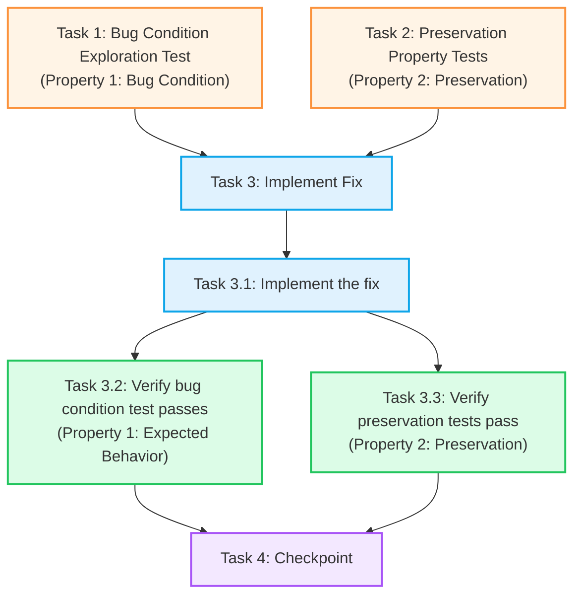

# Implementation Plan

## Overview

Bu plan, sektör detay sayfalarındaki timing bug'ını düzeltmek için exploratory bugfix workflow'unu kullanır:

1. **Exploration** (Task 1): Bug condition testini yaz - `companies` state'i boşken özet hesaplamasının "0 şirket" gösterdiğini doğrula
2. **Preservation** (Task 2): Mevcut davranışları korumak için property testlerini yaz - loading, render, navigasyon fonksiyonlarını doğrula
3. **Implementation** (Task 3): Özet hesaplamasını `companies` state'ine dependency olarak bağla
4. **Validation** (Task 4): Tüm testlerin başarılı olduğunu doğrula

**Bug Condition:** `companies` state'i güncelenmeden önce özet hesaplaması yapılıyor

**Expected Behavior:** `companies` state'i güncellendiğinde özet otomatik olarak hesaplanmalı

## Bug: Sektör Detay Sayfa Yükleme Hatası

### Sorun Özeti
Sektör detay sayfalarında (`/sektorler/$slug`) sektör özeti yanlış hesaplanıyor. `companies` state'i boşken özet hesaplaması yapıldığı için her zaman "0 şirket" ve "%0 değişim" gösteriliyor.

---

## Tasks

- [ ] 1. Write bug condition exploration test
  - **Property 1: Bug Condition** - Sektör Özeti Timing Bug Testi
  - **KRİTİK**: Bu test ŞU ANKİ (unfixed) kod üzerinde çalıştırıldığında BAŞARISIZ OLMALIDIR - başarısızlık bug'ın varlığını kanıtlar
  - **DÜZELTMEYİ DENEME**: Test veya kod başarısız olduğunda düzeltmeye çalışma, bu beklenen davranıştır
  - **NOT**: Bu test beklenen davranışı kodlar - fix uygulandıktan sonra geçtiğinde düzeltmeyi doğrular
  - **HEDEF**: Bug'ın var olduğunu gösteren counterexample'ları ortaya çıkar
  - **Scoped PBT Yaklaşımı**: Deterministik buglar için, property'yi somut başarısız case'lere daralt (reproducibility için)
  - Test implementasyonu: Bug Condition spesifikasyonundan detaylar
    - Sektör detay sayfası yüklendiğinde (örn: `/sektorler/holdingler`)
    - API'den şirket verisi geldiğinde (örn: 15 şirket)
    - Sektör özetinin "0 şirket" ve "%0 değişim" gösterdiğini assert et
  - Test assertion'ları Expected Behavior Properties ile eşleşmelidir:
    - `companies.length > 0` OLMASINA RAĞMEN özet "0 şirket" gösterir
    - API'den ortalama değişim hesaplanabilir OLMASINA RAĞMEN özet "%0" gösterir
  - Unfixed kod üzerinde test çalıştır
  - **BEKLENEN SONUÇ**: Test BAŞARISIZ OLUR (bu doğrudur - bug'ın var olduğunu kanıtlar)
  - Counterexample'ları dokümante et (root cause'u anlamak için)
  - Test yazıldığında, çalıştırıldığında ve başarısızlık dokümante edildiğinde görevi tamamlanmış say
  - _Requirements: 1.1, 1.2, 1.3, 2.1, 2.2, 2.4_

- [ ] 2. Write preservation property tests (BEFORE implementing fix)
  - **Property 2: Preservation** - Mevcut Sayfa Davranışları Korunumu
  - **ÖNEMLİ**: Observation-first metodolojisini takip et
  - Unfixed kod üzerinde bug olmayan inputlar için davranışı gözlemle:
    - Loading durumu test: "Veriler yükleniyor" mesajı gösterilir
    - Şirket listesi render test: Tablo doğru render edilir, hover efektleri çalışır
    - Şirket navigasyon test: Şirkete tıklandığında `/panel/sirketler/${ticker}` sayfasına gidilir
    - Chat soruları test: Suggested questions'a tıklandığında chat'e mesaj gönderilir
    - Back button test: "Sektörlere Dön" butonuna tıklandığında `/sektorler` sayfasına gidilir
    - Stats boxes test: Yükselen/Düşen/Düz şirket sayıları doğru hesaplanır
  - Property-based testler yazarak gözlenen davranış patternlerini yakala (Preservation Requirements'tan)
  - Property-based testing daha güçlü garantiler için birçok test case'i generate eder
  - Unfixed kod üzerinde testleri çalıştır
  - **BEKLENEN SONUÇ**: Testler BAŞARILI OLUR (korunacak baseline davranışı doğrular)
  - Testler yazıldığında, çalıştırıldığında ve unfixed kod üzerinde başarılı olduğunda görevi tamamlanmış say
  - _Requirements: 3.1, 3.2, 3.3, 3.4, 3.5, 3.6_

- [ ] 3. Fix for sektör özeti yanlış hesaplanma bug'ı

  - [ ] 3.1 Implement the fix
    - Sektör özeti hesaplamasını mevcut `useEffect`'ten kaldır (satır 78-82)
    - Yeni bir `useEffect` hook'u ekle, dependency array'ine `[companies, sectorName, loading]` ekle
    - Loading durumunda özet hesaplamasını skip et
    - `companies` state'i güncellendiğinde otomatik olarak özet hesapla
    - Ortalama değişim yüzdesini doğru formatta hesapla (+ işareti, 2 decimal)
    - Edge case: `companies.length === 0` durumunda da "0 şirket" ve "%0" göster (gerçekten boş sektörler için)
    - _Bug_Condition: `isBugCondition(executionContext) = executionContext.calculationPoint === "before_state_update" AND executionContext.companies.length === 0`_
    - _Expected_Behavior: `companies` state'i güncellendiğinde özet otomatik hesaplanmalı, doğru şirket sayısı ve ortalama değişim gösterilmeli_
    - _Preservation: API çağrıları, şirket listesi render'ı, loading durumu, navigasyon, chat soruları, back button, stats boxes değişmeden çalışmalı_
    - _Requirements: 1.1, 1.2, 1.3, 2.1, 2.2, 2.3, 2.4, 3.1, 3.2, 3.3, 3.4, 3.5, 3.6_

  - [ ] 3.2 Verify bug condition exploration test now passes
    - **Property 1: Expected Behavior** - Doğru Sektör Özeti Hesaplaması
    - **ÖNEMLİ**: Task 1'deki AYNI testi tekrar çalıştır - yeni test yazma
    - Task 1'deki test beklenen davranışı kodlar
    - Bu test başarılı olduğunda, beklenen davranışın karşılandığını doğrular
    - Bug condition exploration testini (step 1'den) tekrar çalıştır
    - **BEKLENEN SONUÇ**: Test BAŞARILI OLUR (bug'ın düzeltildiğini doğrular)
    - _Requirements: 2.1, 2.2, 2.3, 2.4_

  - [ ] 3.3 Verify preservation tests still pass
    - **Property 2: Preservation** - Regresyon Kontrolü
    - **ÖNEMLİ**: Task 2'deki AYNI testleri tekrar çalıştır - yeni testler yazma
    - Preservation property testlerini (step 2'den) tekrar çalıştır
    - **BEKLENEN SONUÇ**: Testler BAŞARILI OLUR (regresyon olmadığını doğrular)
    - Tüm testlerin fix sonrasında hala başarılı olduğunu doğrula (regresyon yok)

- [ ] 4. Checkpoint - Ensure all tests pass
  - Tüm testlerin başarılı olduğundan emin ol, sorular çıkarsa kullanıcıya sor.

---

## Task Dependency Graph

```json
{
  "waves": [
    {
      "name": "Exploration & Preservation",
      "tasks": ["1", "2"]
    },
    {
      "name": "Implementation",
      "tasks": ["3.1"]
    },
    {
      "name": "Validation",
      "tasks": ["3.2", "3.3"]
    },
    {
      "name": "Checkpoint",
      "tasks": ["4"]
    }
  ]
}
```



**Legend:**
- 🟠 **Orange (Tasks 1-2)**: Exploration & Preservation tests (run BEFORE fix)
- 🔵 **Blue (Task 3.1)**: Implementation phase
- 🟢 **Green (Tasks 3.2-3.3)**: Validation phase (verify fix works)
- 🟣 **Purple (Task 4)**: Final checkpoint

**Critical Path:** T1 → T3 → T3.1 → T3.2 → T4

**Parallel Work:** Tasks 1 and 2 can be executed in parallel

---

## Notes

### Testing Strategy

- **Property-Based Testing**: Tasks 1 ve 2 property-based testler kullanır - bu yaklaşım birçok test case'i otomatik generate ederek edge case'leri yakalar
- **Observation-First**: Task 2'de önce unfixed kod üzerinde gözlem yap, sonra testleri yaz - bu gerçek davranışı yakalar, varsayılan davranışı değil
- **Expected Failures**: Task 1 testi unfixed kod üzerinde BAŞARISIZ olmalı - bu bug'ın varlığını kanıtlar

### Implementation Notes

- **React Hook Dependencies**: Fix `useEffect` dependency array'inde `[companies, sectorName, loading]` kullanmalı
- **Edge Cases**: `companies.length === 0` durumunu handle et (gerçekten boş sektörler için)
- **Format**: Ortalama değişim + işareti ve 2 decimal ile gösterilmeli

### File References

- **Target File**: `src/routes/panel.sektorler.$slug.tsx` (satır 78-82)
- **Test Location**: Tests should be created in appropriate test directory (e.g., `src/routes/__tests__/`)

### Risk Areas

- **Timing Issues**: `useEffect` execution order critical - ensure dependencies are correct
- **State Management**: React state updates are asynchronous - test async behavior
- **Preservation**: Chat functionality, navigation, and stats calculations must not regress
